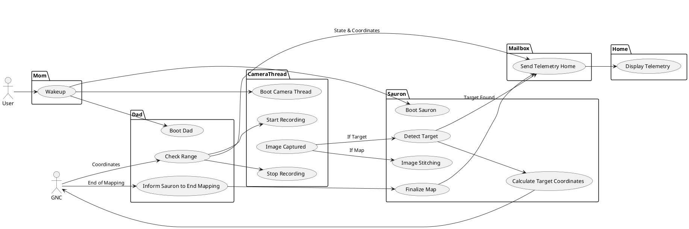
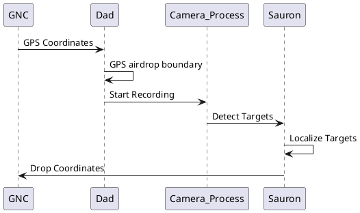
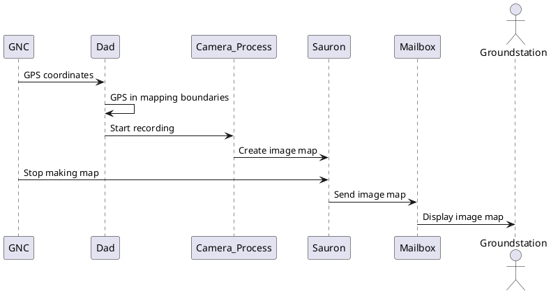
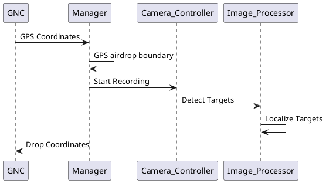
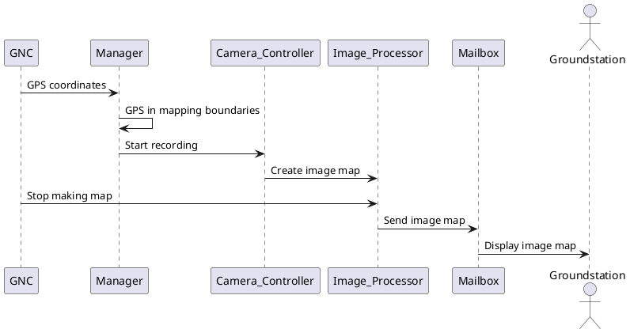
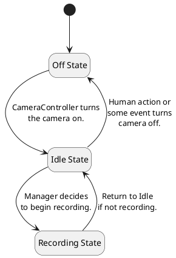
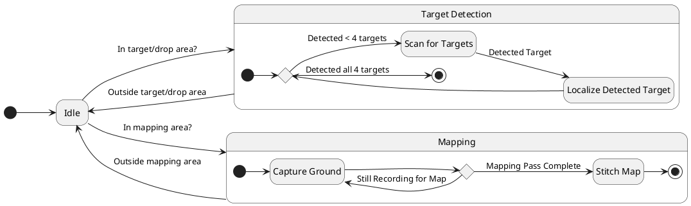
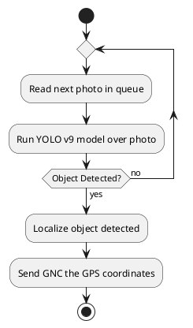
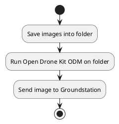

# Feonix Documentation

## Feonix Use Case Diagram

<!-- markdownlint-disable line-length -->

<!-- markdownlint-enable line-length -->

## ODLC Sequence Diagram

## Image Mapping Sequence Diagram

## Professional ODLC Sequence Diagram

## Professional Image Mapping Sequence Diagram

## Professional ODLC State Diagram

## Sauron State Diagram

## Activity Diagram for ODLC Pipeline

## Activity Diagram for Image Stitching Pipeline

