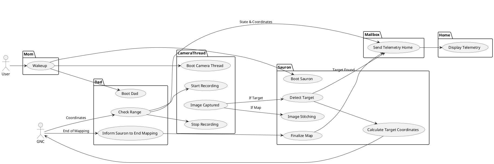
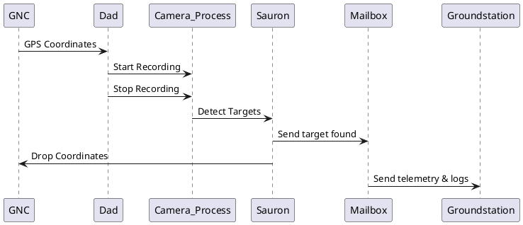
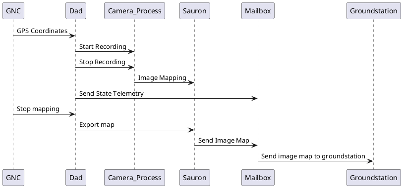

# Feonix Documentation

## Feonix Use Case Diagram

<!-- markdownlint-disable line-length -->

<!-- markdownlint-enable line-length -->

## ODLC Sequence Diagram

## Image Mapping Sequence Diagram

