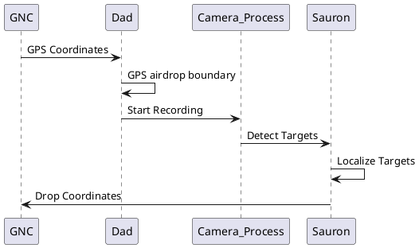
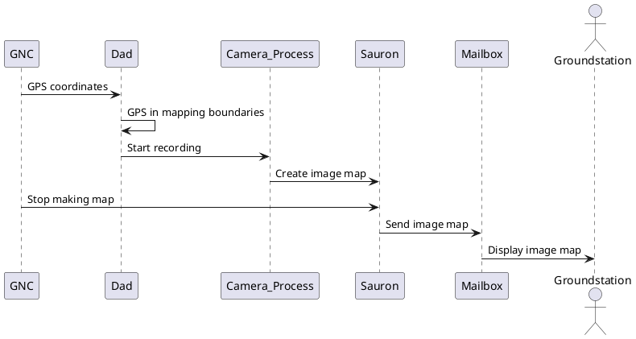
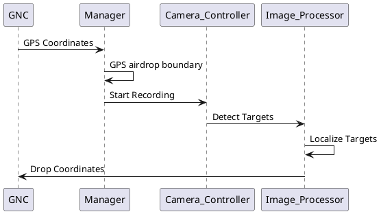
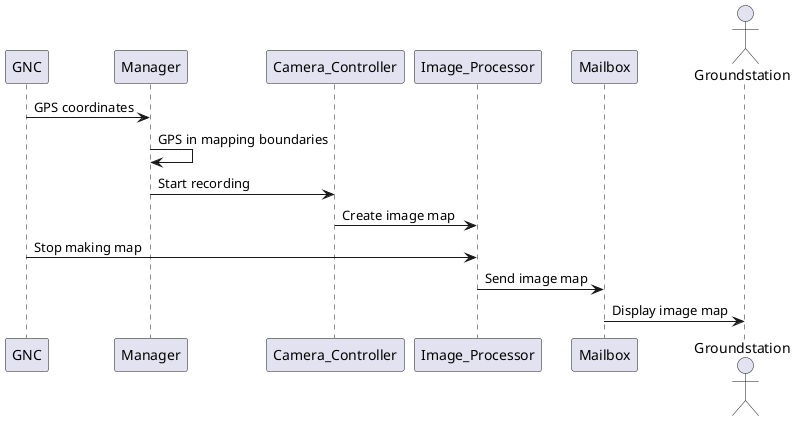
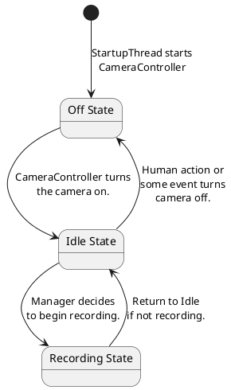
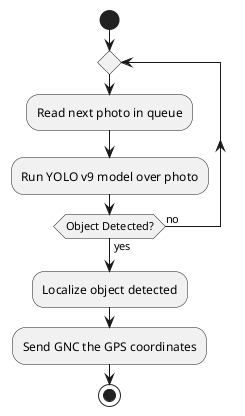
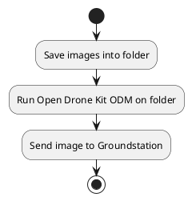

# Feonix Documentation

## Feonix Use Case Diagram

<!-- markdownlint-disable line-length -->


<!-- markdownlint-enable line-length -->

## ODLC Sequence Diagram



## Image Mapping Sequence Diagram



## Professional ODLC Sequence Diagram



## Professional Image Mapping Sequence Diagram



## Professional ODLC State Diagram


## Professional Image Mapping State Diagram
```plantuml
[*] --> IdleState : StartupThread\nstarts\nManager

state "Idle State" as IdleState {
}

state "In Range State" as InRangeState {
}

state "Mapping State" as MappingState {
}

IdleState --> InRangeState : GNC reports coordinates\nwithin mapping or\ndropping area.
InRangeState --> IdleState : Return to Idle\nif not within area.
InRangeState --> MappingState : GNC tells us\nto start mapping.
MappingState --> IdleState : GNC tells us\nto stop mapping.
```

## Activity Diagram for ODLC Pipeline



## Activity Diagram for Image Stitching Pipeline


